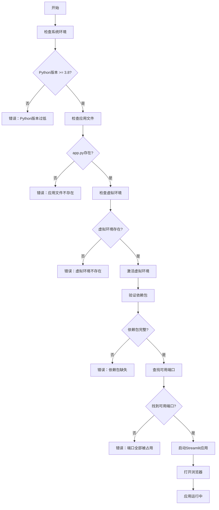

# 🚀 抖音电商数据清洗工具 - 快速启动脚本使用说明

## 📋 脚本概述

本项目提供了三种快速启动脚本，支持不同操作系统和使用习惯：

| 脚本文件 | 适用系统 | 脚本类型 | 推荐用户 |
|---------|---------|---------|---------|
| `start_app.sh` | Linux/macOS | Bash Shell | 熟悉命令行的用户 |
| `quick_start.py` | 跨平台 | Python脚本 | Python开发者 |
| `start_app.bat` | Windows | 批处理文件 | Windows用户 |

## 🔧 功能特性

### ✅ 核心功能
- **环境检查**：自动检查操作系统、Python版本、应用文件
- **虚拟环境管理**：检查并激活 `douyin_cleaner_env` 虚拟环境
- **依赖验证**：验证 streamlit、pandas、openpyxl 等关键依赖
- **智能端口管理**：自动检测可用端口（8507→8508→8509→8510→8511）
- **应用启动**：启动Streamlit应用并自动打开浏览器
- **友好错误处理**：提供详细的错误信息和解决建议

### 🎨 用户体验
- **彩色输出**：不同类型的消息使用不同颜色显示
- **进度提示**：实时显示启动进度和状态信息
- **自动浏览器**：3秒后自动打开浏览器访问应用
- **一键启动**：无需记忆复杂的命令行参数

## 🚀 快速开始

### Linux/macOS 用户

#### 方法1：使用 Bash 脚本（推荐）
```bash
# 1. 给脚本执行权限
chmod +x start_app.sh

# 2. 启动应用
./start_app.sh

# 3. 仅检查环境（不启动应用）
./start_app.sh --check

# 4. 显示帮助信息
./start_app.sh --help
```

#### 方法2：使用 Python 脚本
```bash
# 1. 启动应用
python3 quick_start.py

# 2. 仅检查环境
python3 quick_start.py --check

# 3. 显示帮助信息
python3 quick_start.py --help
```

### Windows 用户

#### 方法1：使用批处理文件（推荐）
```cmd
# 双击运行 start_app.bat 文件
# 或在命令提示符中运行：
start_app.bat
```

#### 方法2：使用 Python 脚本
```cmd
# 在命令提示符中运行：
python quick_start.py
```

## 📊 启动流程



## 🛠️ 环境要求

### 系统要求
- **操作系统**：Linux、macOS、Windows
- **Python版本**：3.8 或更高版本
- **虚拟环境**：douyin_cleaner_env

### 依赖包要求
```txt
streamlit >= 1.32.0
pandas >= 1.5.0
openpyxl >= 3.0.0
```

### 目录结构
```
项目根目录/
├── app.py                    # 主应用文件
├── douyin_cleaner_env/       # 虚拟环境目录
├── requirements.txt          # 依赖包列表
├── start_app.sh             # Linux/macOS启动脚本
├── quick_start.py           # Python启动脚本
├── start_app.bat            # Windows启动脚本
└── 启动脚本使用说明.md        # 本说明文档
```

## 🔍 故障排除

### 常见问题及解决方案

#### 1. 权限错误（Linux/macOS）
```bash
# 问题：Permission denied
# 解决：给脚本执行权限
chmod +x start_app.sh
```

#### 2. Python未找到
```bash
# 问题：python: command not found
# 解决：安装Python或检查PATH环境变量
# Ubuntu/Debian: sudo apt install python3
# CentOS/RHEL: sudo yum install python3
# macOS: brew install python3
```

#### 3. 虚拟环境不存在
```bash
# 问题：虚拟环境 'douyin_cleaner_env' 不存在
# 解决：创建虚拟环境
python3 -m venv douyin_cleaner_env
source douyin_cleaner_env/bin/activate  # Linux/Mac
# 或
douyin_cleaner_env\Scripts\activate     # Windows
pip install -r requirements.txt
```

#### 4. 依赖包缺失
```bash
# 问题：ModuleNotFoundError: No module named 'streamlit'
# 解决：安装依赖包
pip install streamlit pandas openpyxl
# 或
pip install -r requirements.txt
```

#### 5. 端口被占用
```bash
# 问题：所有首选端口都被占用
# 解决：脚本会自动寻找可用端口，或手动停止占用端口的进程
# 查看端口占用：
netstat -tulpn | grep :8507
# 停止进程：
kill -9 <PID>
```

#### 6. 浏览器无法自动打开
```bash
# 问题：无法自动打开浏览器
# 解决：手动访问显示的URL
# 例如：http://localhost:8507
```

## 📈 高级用法

### 自定义配置

#### 修改首选端口
编辑脚本文件中的端口列表：
```bash
# start_app.sh
PREFERRED_PORTS=(8507 8508 8509 8510 8511)

# quick_start.py
self.preferred_ports = [8507, 8508, 8509, 8510, 8511]
```

#### 修改虚拟环境名称
```bash
# start_app.sh
VENV_NAME="your_custom_env"

# quick_start.py
self.venv_name = "your_custom_env"
```

### 集成到IDE

#### VS Code 集成
在 `.vscode/tasks.json` 中添加任务：
```json
{
    "version": "2.0.0",
    "tasks": [
        {
            "label": "启动数据清洗工具",
            "type": "shell",
            "command": "./start_app.sh",
            "group": "build",
            "presentation": {
                "echo": true,
                "reveal": "always",
                "focus": false,
                "panel": "new"
            }
        }
    ]
}
```

#### PyCharm 集成
1. 打开 Run/Debug Configurations
2. 添加新的 Shell Script 配置
3. 设置脚本路径为 `start_app.sh`

## 📞 技术支持

### 获取帮助
```bash
# 显示帮助信息
./start_app.sh --help
python3 quick_start.py --help
```

### 环境检查
```bash
# 仅检查环境，不启动应用
./start_app.sh --check
python3 quick_start.py --check
```

### 日志调试
如果遇到问题，可以查看详细的启动日志来诊断问题。

---

## 🎉 总结

通过这些快速启动脚本，您可以：
- **一键启动**：无需记忆复杂命令
- **自动检查**：确保环境配置正确
- **智能管理**：自动处理端口冲突
- **友好提示**：清晰的错误信息和解决建议
- **跨平台支持**：Linux、macOS、Windows全覆盖

选择适合您系统的脚本，享受便捷的数据清洗工具使用体验！
